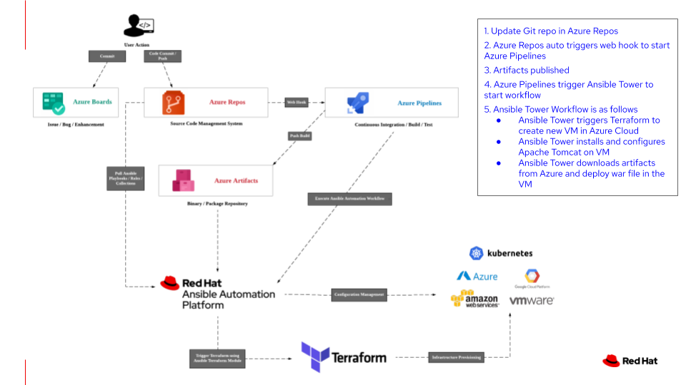

# Azure DevOps with Ansible and Terraform

Many enterprise organizations going through digital transformations are adopting DevOps as their new operating model for IT. DevOps describes approaches to speeding up the processes by which an idea such as a new software feature, a request for enhancement or a bug fix goes from development to deployment in a production environment. CI/CD is a method to frequently deliver apps to customers by introducing automation into the stages of app development.

This demo looks at how Azure DevOps can work with Red Hat Ansible Automation Platform and Terraform to achieve continuous integration, continuous delivery/deployment.

The scenario is as shown in the diagram below (demo was done using Ansible Tower 3.7.3 with Ansible Engine 2.9.14)

The YouTube video can be found at this [link](https://youtu.be/OEqMdxDveYA)
