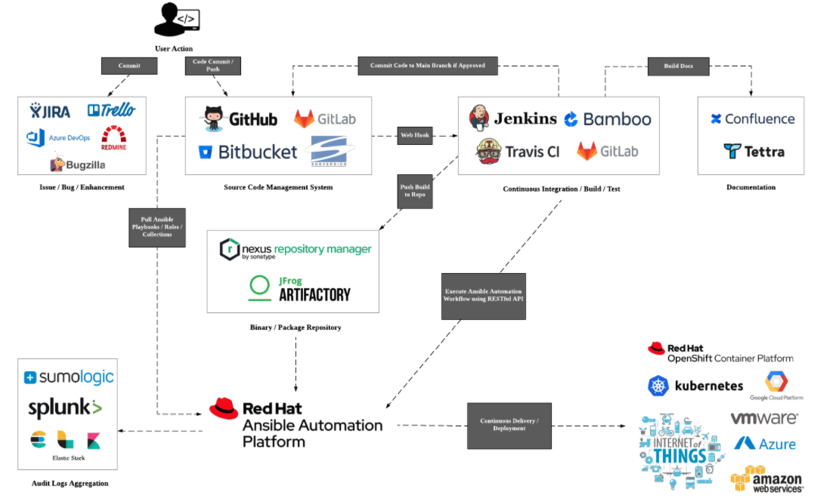
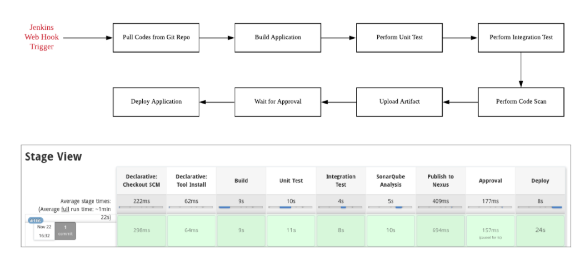

# Ansible Tower Integration with Jenkins in CI/CD Process

Taking ideas from this blog [post](https://www.redhat.com/en/blog/integrating-ansible-jenkins-cicd-process), we will look at how Ansible Tower can be used for application deployment in a Continuous Integration/Continuous Delivery (CI/CD) process using a Jenkins Pipeline.

Jenkins is a well-known tool for implementing CI/CD. Shell scripts are commonly used for provisioning environments or to deploy applications during the pipeline flow. Although this will work, it is cumbersome to maintain and reuse scripts in the long run.

The purpose of using Ansible Tower in the pipeline flow is to reuse roles, playbooks and automation workflows for provisioning and application deployment so that Jenkins will not need to take on the role as a shell script executor.

While Ansible Tower can easily spin up the required infrastructure for on-prem and public clouds such as AWS, Azure and Google, this demo will only focus on the application deployment piece as we have already demonstrated infrastructure provisioning in other demos.

A generic CI/CD workflow using Ansible automation for Continous Deployment/Delivery is depicted in the diagram below (demo was done using Ansible Tower 3.8.0 with Ansible Engine 2.9.15)

The Jenkins pipeline flow is as follows

The other piece of codes that was used for the demo can be found at this [repo](https://github.com/eanylin/test-quarkus)

The YouTube video can be found at this [link](https://youtu.be/sBWlR9zFBdI)
