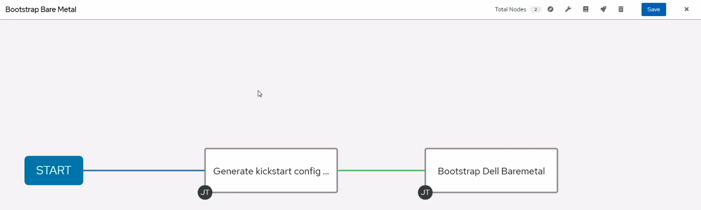

# Dell Bare Metal Server PXE Boot and RHEL 8 Installation

In this demo, we look at how the certified Dell EMC Ansible module can be used to perform PXE boot and RHEL OS installation on Dell bare metal node.

The scenario is as shown in the diagram below (the demo was done using Ansible Automation Platform 2.0.1 with Ansible Core 2.11)

The YouTube video can be found at this [link](https://youtu.be/o8xN9XRTYT0)
