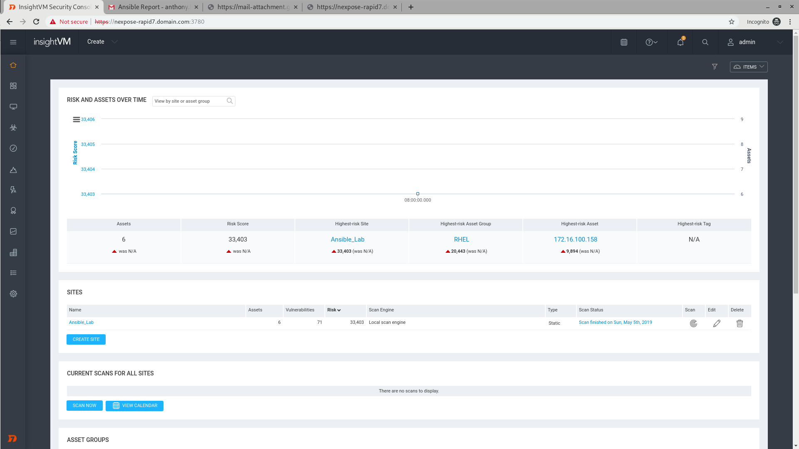
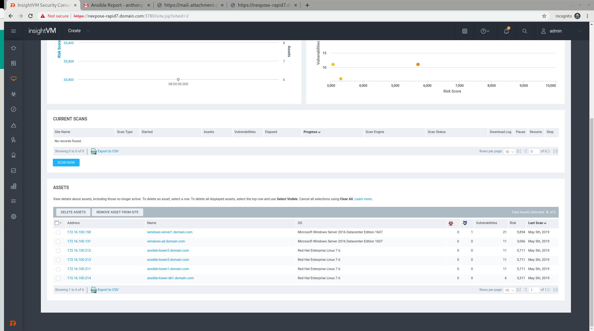
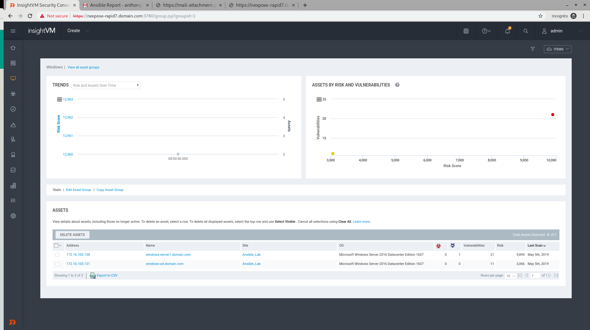
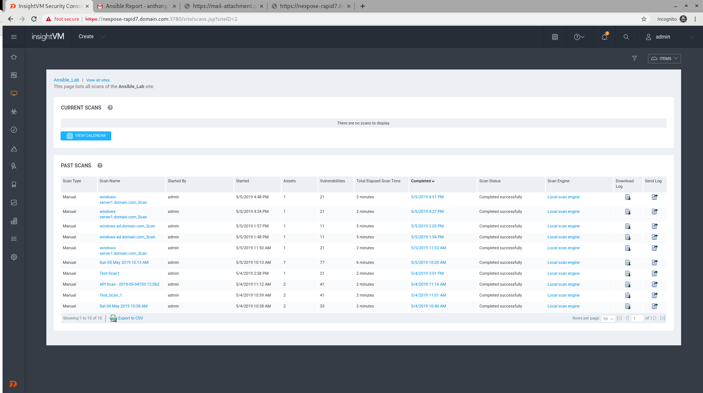
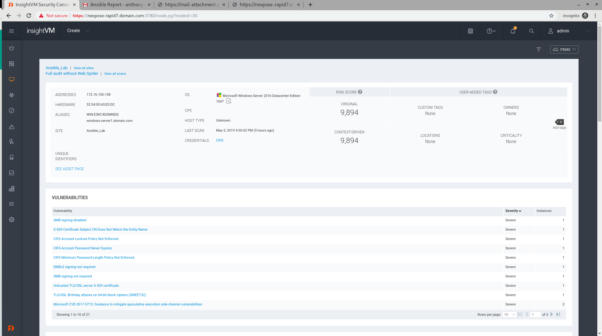
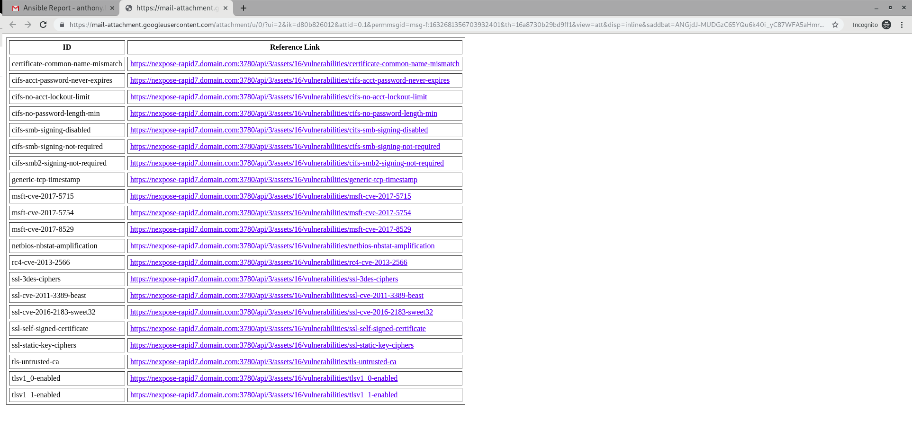
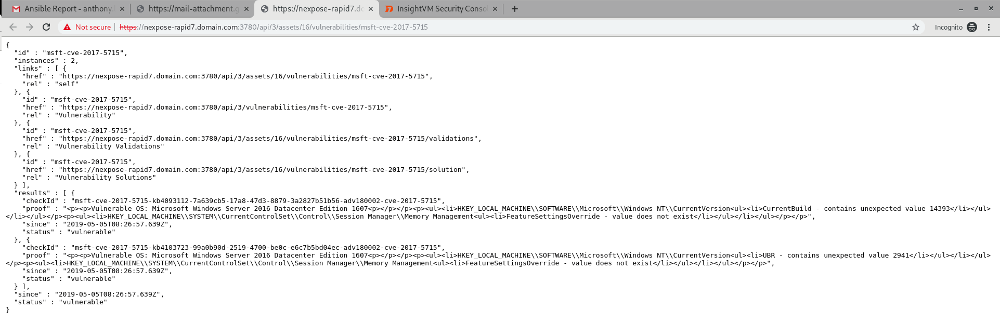

## Integration of Ansible Tower with Nexpose Rapid7

The playbooks in this repository is meant to

1. Add a new asset and perform a scan on it
2. Perform ad hoc scan on an asset

### Adding New Asset to Nexpose Rapid7

User will need to provide information for the following variables

1. target_server - Server to be added
2. target_server_id - IP Address of Server to be added
3. site_id - The ID of site in Nexpose Rapid7
4. asset_group_id - The ID of the asset group

The workflow will perform the following tasks

1. Create entry for the new VM in Nexpose Rapid7
2. Perform a scan on the new VM
3. Generate a summary report and email the HTML report to relevant parties

The end result will look like the following

#### Scan Results

### Perform Ad Hoc Scan on an Asset

User will need to provide information for the following variables

1. target_server - Server to be added
2. site_id - The ID of site in Nexpose Rapid7
