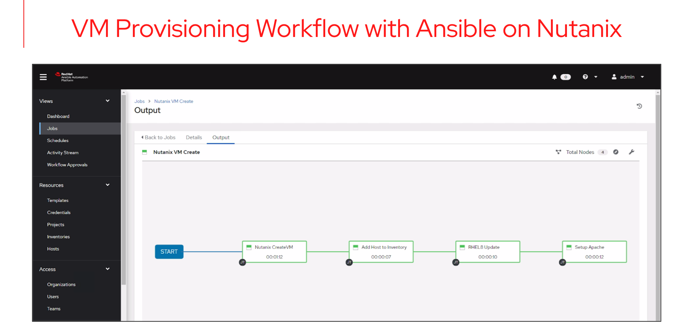

# Nutanix VM Provisioning - PRISM and Ansible Automation Platform

Ansible Automation Platform can be easily integrated with Nutanix PRISM via REST API.

This demo shows how we can leverage the PRISM APIv3 to create a workflow to provision virtual machines on Nutanix virtualization platform. Note that Ansible is able to automate any tasks on the Nutanix virtualization platform via PRISM as long as that endpoint exists.

The scenario is as shown in the diagram below (the demo was done using Ansible Automation Platform 2.0.1 with Ansible Core 2.11)

The YouTube video can be found at this [link](https://youtu.be/o0O9zDr0b8Y)
