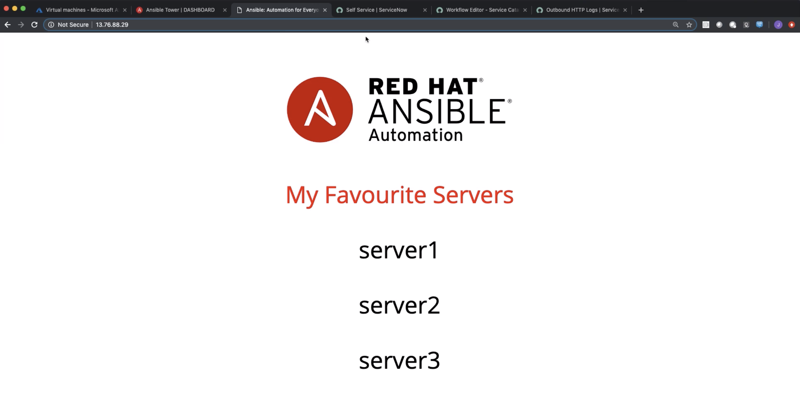
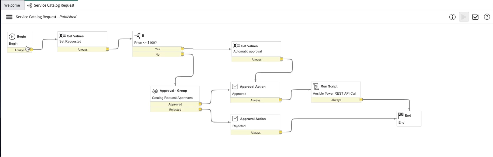
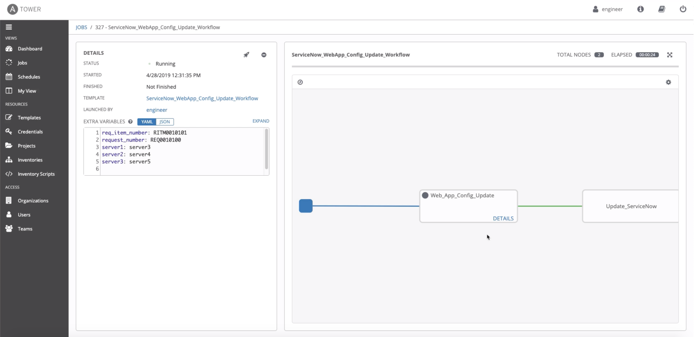

## Web Application Configuration Updates using ServiceNow and Ansible Tower

### Demo Video

The YouTube demo video can be found at this [link](https://youtu.be/kb1wwrbcdAM)

### Environment

Apache Web Server and Ansible Tower 3.4.3 (Ansible Engine 2.7.10) running in Microsoft Azure

### Workflow

1. The initial part of the video shows the *engineer* user logging into Ansible Tower. RBAC is setup in such a way that the user has `Use` role to the `ServiceNow Demo` project, credentials and its associated inventory, as well as the `Execute` role for Job Templates and Workflow. This means that the user will be able to use the project, credentials, inventory and to execute Job Templates and Workflow. Note that the user will not be able to make any changes in Ansible Tower with his/her existing roles.
2. The Web Application Server has `server1`, `server2` and `server3` as the default favourite servers
   
3. The next part of the video shows the ServiceNow dashboard and the workflow that will be triggered in ServiceNow when there is a Service Catalog request
   
4. The business logic in ServiceNow is such that approval is required if the cost is more than **$100**. The script to trigger a *POST* Rest API call towards Ansible Tower will be kicked off once approval is granted.
5. The script will pass all the relevant parameters to Ansible Tower and kick off the appropriate workflow in Ansible Tower to perform the required task
   
6. Next, we will simulate the flow using ServiceNow
   - Log in as *Abraham Lincoln* and make the request to update the configurations of the Web Application. The requested change will be to change the list of favourite servers to `server3`, `server4` and `server5` instead.
   - The request costs *$150*, i.e. more than **$100** and hence requires approval
   - Impersonate the approver, i.e. *Eric Schroeder* and approve the request
   - All required information will get sent over to Ansible Tower via RESTful API call
   - Ansible Tower will kick off the required workflow template using the received information
   - The configurations of the Web Application server gets updated
   - Ansible Tower will update the ticket in ServiceNow with comments and close off the ticket

7. Check that the configurations of the Web Application Server was updated successfully, i.e. the list of favourite servers has been changed from `server1`, `server2` and `server3` to `server3`, `server4` and `server5`
   

8. Check that ticket in ServiceNow has been successfully updated and closed
   
