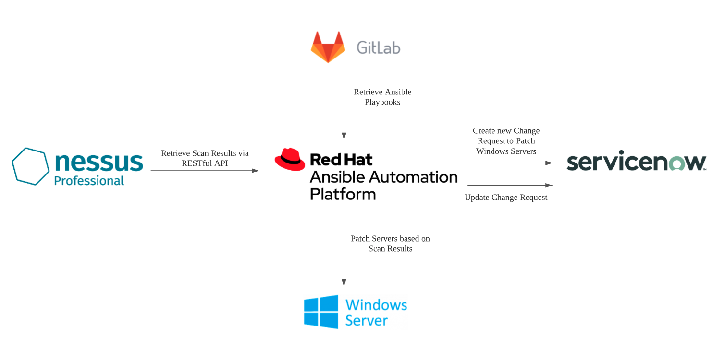

# Tenable Nessus with Ansible Automation

Security is at the heart of every organization. This demo looks at how Red Hat Ansible Automation Platform can be integrated with Vulnerability Assessment Scanners such as Tenable Nessus and ITSM such as ServiceNow to determine and install the missing patches for Windows Servers.

The scenario is as shown in the diagram below (the demo was done using Ansible Tower 3.8.2 with Ansible Engine 2.9.15)

The YouTube video can be found at this [link](https://youtu.be/I3a3RRgyA9Y)
