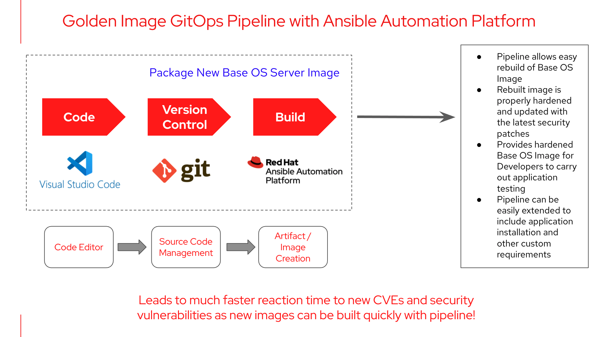

# Golden Image GitOps Pipeline with Ansible Automation Platform

Building or installing Operating Systems for deployment across hybrid cloud environments can be slow, tedious and error prone. In this demo, we look at an opininated approach in setting up a Golden Image pipeline to build a hardened Base Image for Windows Server 2019. The pipeline leverages the workflow functionality in Ansible Automation Platform to build the image - A build is triggered whenever there is a merge request in GitLab. We have decided to go with the GitOps approach as it is a developer-centric approach to Continuous Delivery and Infrastrcture Operation. With Git as the single source of truth, we can drive operations through Git workflows.

In this scenario, a golden image pipeline helps the Operations team in different ways. For instance, the pipeline allows easy rebuild of the Base OS image. The rebuilt image is also properly hardened and updated with the latest security patches. This means that Developers will have timely access to images that are regularly updated, instead of potentially stale images that may have been missing patches or hardening policies, thereby allowing them to test and validate their applications on up-to-date golden images. This is aligned with the idea of DevSecOps where security should be implemented earlier in the lifecycle, following a "shift-left" approach so that it can have an outized impact on improving security and minimizing the overall operational overhead required.

And while the pipeline shown here is mainly used for Golden Image building, it can be easily extended to include Continuous Integration for applications as well as any other custom requirements or configurations.

The scenario is as shown in the diagram below (the demo was done using Ansible Automation Platform 2.1 with Ansible Core 2.12)

The YouTube video can be found at this [link](https://youtu.be/eITpFAZf_tk)
